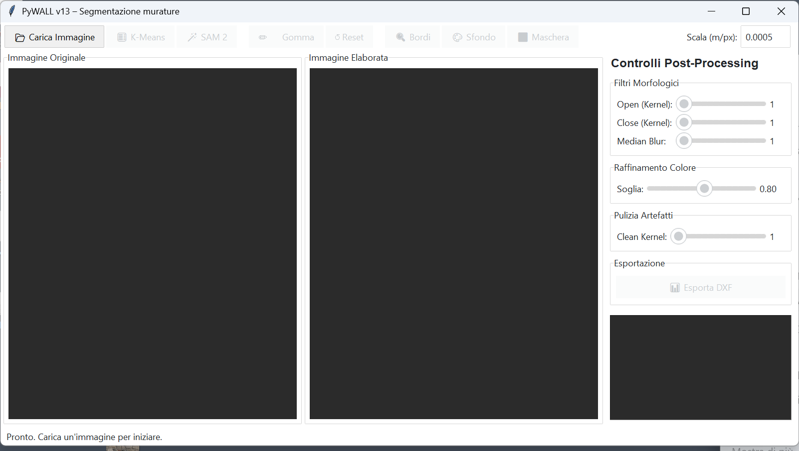

# PyWALL v13

PyWALL is a desktop application for assisting masonry-image segmentation and the production of archaeological drawing outputs. Version 13 is the current public alpha release.

[Project website](https://andreaf-unibo.github.io/) · [Source repository](https://github.com/AndreaF-UniBO/PyWALL) · [Release v0.13.0](https://github.com/AndreaF-UniBO/PyWALL/releases/tag/v0.13.0)

The application provides two independent segmentation workflows:

- a self-contained K-Means baseline based on colour and texture features;
- optional automatic-mask generation through Meta's official Segment Anything Model 2 (SAM 2) implementation.

The historical custom deep-learning pipeline is not part of PyWALL v13.

## Status

PyWALL v13 is an alpha-quality research-software release (`0.13.0`). Its outputs must be reviewed by an archaeologist and must not be treated as validated interpretations without expert assessment.



## Main features

- Load JPEG and PNG masonry photographs.
- Segment an image with K-Means or Meta SAM 2.
- Refine the binary masonry mask through morphological and colour controls.
- Correct the result manually with an eraser tool.
- Inspect contours and binary masks.
- Export masks as PNG and traced contours as DXF.

## Requirements

- Windows 10 or Windows 11 for the supplied PowerShell setup scripts.
- 64-bit Python 3.11.
- At least 8 GB of free space during setup. The verified local bundle occupies approximately 5.2 GB after installation.
- For SAM 2: an NVIDIA CUDA-capable GPU is recommended. CPU inference is possible but may be very slow.

Meta recommends WSL for SAM 2 on Windows. This bundle also provides a native-Windows setup for local validation; compatibility must be confirmed on the target computer.

## Installation

Open PowerShell in this directory and run:

```powershell
Set-ExecutionPolicy -Scope Process Bypass
.\scripts\setup_windows.ps1
.\scripts\download_sam2_checkpoint.ps1
.\scripts\test_local.ps1
.\scripts\run_pywall.ps1
```

The scripts create an isolated `.venv`, install the core application, install PyTorch and the official Meta SAM 2 package, download the official `sam2.1_hiera_base_plus.pt` checkpoint, verify its SHA-256 checksum, and run the smoke tests.

Use `setup_windows.ps1 -Cpu` only when CUDA is unavailable.

Detailed Italian instructions are available in [README_PyWALL_v13.md](README_PyWALL_v13.md).

## Manual installation

```powershell
py -3.11 -m venv .venv
.\.venv\Scripts\python.exe -m pip install --upgrade pip
.\.venv\Scripts\python.exe -m pip install -e ".[dev]"
.\.venv\Scripts\python.exe -m pip install torch==2.5.1 torchvision==0.20.1 --index-url https://download.pytorch.org/whl/cu121
$env:SAM2_BUILD_CUDA = "0"
.\.venv\Scripts\python.exe -m pip install --no-build-isolation "git+https://github.com/facebookresearch/sam2.git@2b90b9f5ceec907a1c18123530e92e794ad901a4"
```

Then download the official Meta checkpoint following the [checkpoint instructions](checkpoints/README.md).

## Starting the application

```powershell
.\scripts\run_pywall.ps1
```

or:

```powershell
.\.venv\Scripts\python.exe PyWALL_v13.py
```

## Minimal workflow

1. Select **Carica Immagine** and choose one of the published files under `samples/`, or another JPEG or PNG image that you are entitled to process.
2. Select **K-Means** for the core workflow or **SAM 2** for the official Meta model.
3. Adjust the filter controls and, where appropriate, correct the mask manually.
4. Inspect the contours and binary mask.
5. Export a PNG mask or DXF contours.

## Inputs and outputs

Inputs are ordinary raster images supported by Pillow, primarily JPEG and PNG. Images are converted to RGB internally.

The internal binary mask uses `255` for masonry units and `0` for mortar. PyWALL can save the mask as PNG and export detected contours to DXF using the scale entered in the interface.

## Samples

The repository includes three photographs taken by Andrea Fiorini and expressly authorized for distribution as PyWALL test inputs: `071.png`, `080.png`, and `input_04.png`. Their embedded metadata was removed before publication without changing the pixels. Three other local validation images remain excluded because publication has not been authorized. See [samples/README.md](samples/README.md) for the separate copyright terms.

## SAM 2 model handling

PyWALL uses only the official [`facebookresearch/sam2`](https://github.com/facebookresearch/sam2) backend. It does not use Ultralytics and never downloads weights silently. The official checkpoint is stored locally under `checkpoints/` and remains excluded from Git.

## Known limitations

- SAM 2 installation on native Windows is best-effort; Meta recommends WSL.
- First model loading can require substantial RAM and GPU memory.
- Automatic SAM 2 masks identify visual regions; the area-fusion heuristic does not classify archaeological relationships.
- Segmentation quality depends on lighting, image scale, surface condition and parameter selection.
- Only environments actually reported in the test log should be considered tested.

## Project structure

```text
PyWALL_v13.py             Main Tkinter desktop application
sam2_segmentation.py      Official Meta SAM 2 adapter
checkpoints/              Local Meta checkpoint and verification information
samples/                  Three authorized examples and their copyright terms
scripts/                  Windows setup, download, test and launch helpers
tests/                    Unit, GUI and optional model smoke tests
docs/                     Local verification notes
pyproject.toml            Packaging and dependency metadata
```

## Citation and authorship

PyWALL is authored by Andrea Fiorini, Department of History and Cultures, Alma Mater Studiorum – University of Bologna. See [CITATION.cff](CITATION.cff) for machine-readable citation metadata.

## License

PyWALL source code is licensed under the [Apache License 2.0](LICENSE). The photographs in `samples/` are not covered by that licence and remain copyright Andrea Fiorini under the terms stated in [samples/README.md](samples/README.md). Third-party packages and the Meta SAM 2 model remain subject to their upstream terms; see [THIRD_PARTY_NOTICES.md](THIRD_PARTY_NOTICES.md) and [NOTICE](NOTICE).
