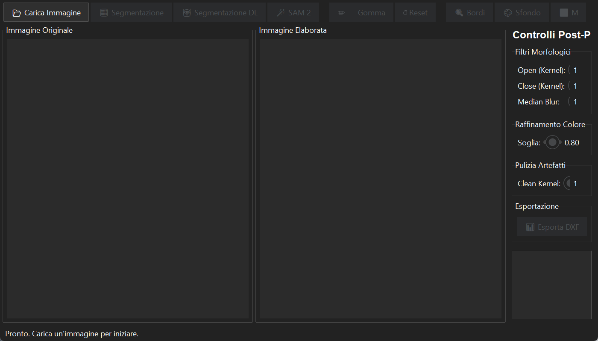

# WALLpy

[](https://github.com/AndreaF-UniBO/WALLpy/actions/workflows/tests.yml)
[](https://andreaf-unibo.github.io/)

WALLpy is a local desktop application for segmenting masonry units and mortar joints in raster images. It supports image-based documentation workflows in archaeology of architecture by turning a reviewed segmentation into a binary raster mask or scaled DXF contour geometry.

The application combines an unsupervised K-Means workflow with optional Segment Anything Model 2 (SAM 2) support. A separate legacy deep-learning command can be connected to an existing WALLpy model installation; the trained legacy model and its dataset are not distributed here.

> **Project status:** preliminary research software. The packaging version is `0.1.0`, but no public release should be issued until the repository license has been selected and all release checks have passed. Segmentation results require expert review and must not be treated as an autonomous archaeological interpretation.



## Scientific scope

WALLpy addresses the time-consuming separation of masonry elements and joints in rectified or conventional photographs. Its outputs can support subsequent drawing and documentation, but their archaeological validity depends on image quality, parameter choices, scale calibration, and specialist assessment.

### Main features

- K-Means segmentation using colour, edge, and local-texture features.
- Optional automatic-mask generation with SAM 2 through Ultralytics or the official Meta backend.
- Morphological opening, closing, median filtering, and colour-based refinement.
- Manual erasing and contour preview in the desktop interface.
- Binary PNG-mask export.
- Scaled DXF polyline export for further drafting or analysis.
- Optional connection to the historical WALLpy supervised model installation.

## Requirements

- Python 3.11 or newer. Python 3.11 is the version currently used for validation.
- A desktop session with Tk 8.6 or compatible Tk support.
- Sufficient memory for the selected image and segmentation method.
- SAM 2 is optional. A CUDA-capable GPU can accelerate model inference, but CPU execution is supported by the backends and may be slow.

WALLpy is currently tested on Windows. Other operating systems are not yet claimed as verified even though the core libraries are cross-platform.

## Installation

Clone the repository, create an isolated environment, and install the application:

```powershell
git clone https://github.com/AndreaF-UniBO/WALLpy.git
cd WALLpy
py -3.11 -m venv .venv
.\.venv\Scripts\Activate.ps1
python -m pip install --upgrade pip
python -m pip install .
```

For the optional Ultralytics SAM 2 backend:

```powershell
python -m pip install ".[sam]"
```

Ultralytics is licensed upstream under AGPL-3.0. Installing this optional extra adds a separately licensed component to the runtime environment; review the [third-party notices](THIRD_PARTY_NOTICES.md) and the upstream terms before use or redistribution.

For development and tests:

```powershell
python -m pip install -e ".[dev]"
python -m pytest
```

The official Meta SAM 2 backend can also be installed from its upstream repository. Download its checkpoint separately into `checkpoints/`; see [checkpoint setup](checkpoints/README.md). Model weights are intentionally excluded from this repository.

## Starting the application

After installation, use either command:

```powershell
wallpy
```

```powershell
python WALLpy_v12.py
```

The application is a desktop GUI, not a web service. GitHub Pages hosts only the project links and static documentation; it cannot execute WALLpy.

## Minimal workflow

1. Select **Carica Immagine** and open a raster image.
2. Choose **K-Means** for the self-contained baseline, or **SAM 2** if an optional backend is installed.
3. Review the recoloured result and adjust the morphological and colour-refinement controls.
4. Use the eraser and contour preview where necessary.
5. Export a binary PNG mask, or enter a scale in metres per pixel and export DXF contours.

### Inputs

The file dialog accepts common raster formats supported by Pillow, including PNG, JPEG, TIFF, and BMP. WALLpy converts loaded images to RGB. The repository contains no archaeological dataset and no claim is made that a specific acquisition protocol guarantees correct segmentation.

### Outputs

- **Binary PNG:** a monochrome segmentation mask suitable for review or downstream image processing.
- **DXF:** closed lightweight polylines derived from detected masonry contours. Coordinates are scaled using the user-supplied metres-per-pixel value, and the vertical image axis is converted to Cartesian orientation.

Always retain the original image and record the parameters used. WALLpy does not currently write a provenance sidecar or project file.

## Optional legacy deep-learning integration

The **Segmentazione DL** button calls a historical `pred.py` pipeline and model configuration that are not part of this repository. Set `WALLPY_LEGACY_ROOT` to a local directory containing `pred.py` and the expected `output/` model configuration tree:

```powershell
$env:WALLPY_LEGACY_ROOT = "C:\path\to\legacy-wallpy"
wallpy
```

If the variable is absent, WALLpy retains the historical sibling/parent-directory discovery for existing installations. See [legacy integration details](docs/legacy-deep-learning.md).

## Project structure

```text
WALLpy_v12.py          Desktop interface and core image-processing workflow
sam2_segmentation.py   Optional SAM 2 adapter and mask fusion
pyproject.toml         Package metadata and dependency declarations
checkpoints/           Instructions only; model weights are not tracked
docs/assets/           Public documentation assets
tests/                 Deterministic unit and smoke tests
.github/workflows/     Continuous-integration configuration
```

## Known limitations

- The desktop interface is currently in Italian.
- Only Windows with Python 3.11 is part of the present validation scope.
- SAM 2 may download large weights on first use and can require substantial RAM or GPU memory.
- The SAM 2 mask-fusion heuristic filters candidates by relative area; it does not classify architectural relationships.
- The legacy supervised workflow is unavailable without separately obtained model assets and code.
- Exported geometry must be checked and, where necessary, edited by a specialist.

## Troubleshooting

- **`wallpy` is not recognized:** reactivate the virtual environment or run `python WALLpy_v12.py`.
- **Tkinter cannot open a window:** run from a graphical desktop session and verify `python -c "import tkinter"`.
- **SAM 2 is unavailable:** install `.[sam]`, or follow the official-backend checkpoint instructions.
- **SAM 2 is slow or runs out of memory:** use a smaller model, reduce the maximum inference side, or run on a CUDA-capable system.
- **Legacy DL files are missing:** configure `WALLPY_LEGACY_ROOT`; those files are not distributed here.
- **DXF export is disabled:** reinstall the core package and confirm `python -c "import ezdxf"` succeeds.

## Author and affiliation

Andrea Fiorini — Archaeology of Architecture, *Area dei Funzionari – Settore scientifico-tecnologico*, Department of History and Cultures (Ravenna campus), Alma Mater Studiorum – University of Bologna.

- Project website: [andreaf-unibo.github.io](https://andreaf-unibo.github.io/)
- GitHub profile: [AndreaF-UniBO](https://github.com/AndreaF-UniBO)
- Contact: [andrea.fiorini6@unibo.it](mailto:andrea.fiorini6@unibo.it)

## Citation

Citation metadata are provided in [`CITATION.cff`](CITATION.cff). GitHub can use this file to generate a formatted citation after publication. Until a versioned release exists, cite the repository URL together with the accessed commit hash.

## License

No software license has yet been authorized for WALLpy. Consequently, the repository must not be described as open source or redistributed under assumed terms. A `LICENSE` file and matching metadata will be added only after the copyright holder selects a license.

Third-party packages and model weights retain their own licenses; see [`THIRD_PARTY_NOTICES.md`](THIRD_PARTY_NOTICES.md).
